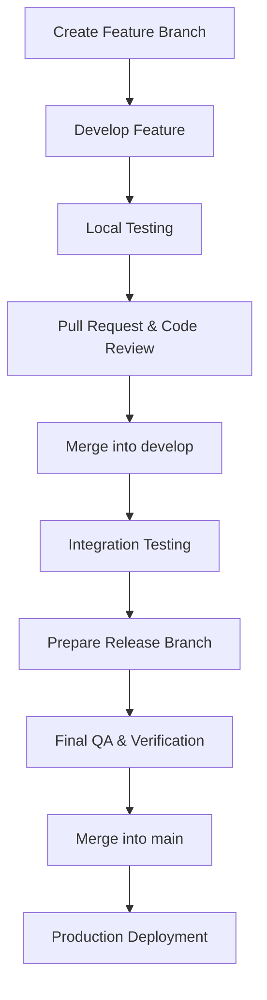

# Portfolio OS — Release Guide

**Version**: 1.0.0  
**Status**: Official Specification  

---

## 1. Purpose

This document defines the official release workflow for **Portfolio OS**.

Every release, regardless of size, should follow this guide. The objective is to ensure that deployments remain predictable, stable, and recoverable.

---

## 2. Release Philosophy

Portfolio OS follows **Semantic Versioning** (`MAJOR.MINOR.PATCH`):

- **`MAJOR`**: Architecture changes, breaking API changes, database redesign, framework migration (e.g., `1.x.x` → `2.0.0`).
- **`MINOR`**: New features, new CMS modules, new dashboard functionality, backward-compatible enhancements (e.g., `1.0.0` → `1.1.0`).
- **`PATCH`**: Bug fixes, performance improvements, security patches, zero breaking changes (e.g., `1.0.1` → `1.0.2`).

---

## 3. Git Branching Strategy

- **`main`**: Production-ready code only.
- **`develop`**: Integration branch for upcoming release work.
- **`feature/*`**: Individual feature developments (e.g., `feature/search`, `feature/media-library`).
- **`hotfix/*`**: Urgent production bug fixes (e.g., `hotfix/login-bug`).
- **`release/*`**: Release candidate preparation (e.g., `release/v1.1.0`).

---

## 4. Development Workflow

---

## 5. Pre-Release & Deployment Checklists

### Pre-Release Verification
- [x] Frontend builds cleanly without warnings or errors.
- [x] Backend API endpoints and handlers build cleanly.
- [x] Environment variables configured and verified.
- [x] Database connections and model schemas reachable.
- [x] Cloudinary / Media storage service operational.
- [x] Authentication & Session Management verified.
- [x] Search, SEO, CMS, and Media Upload features passing smoke tests.

### Deployment Checklist
- [x] Backup database, media assets, and environment configs.
- [x] Create annotated Git tag for release (`git tag -a v1.0.0`).
- [x] Deploy application artifact to production host (Vercel / Netlify / Docker).
- [x] Run database migrations if applicable.
- [x] Verify production health checks (`/api/v1/health` and `/api/v1/health/db`).
- [x] Conduct post-deployment smoke testing across public & dashboard routes.

---

## 6. Definition of Done

A release is considered complete **only** when:
1. Production deployment succeeds.
2. Health monitoring reports `200 OK`.
3. Backup procedures are verified.
4. Release notes and documentation are updated.
5. Git version tag is created and pushed.
6. Zero critical or blocking bugs remain open.
